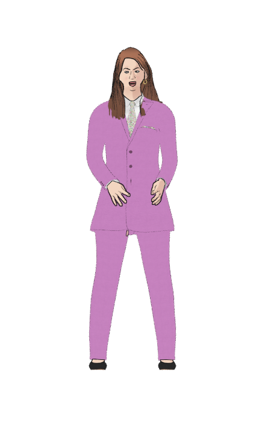
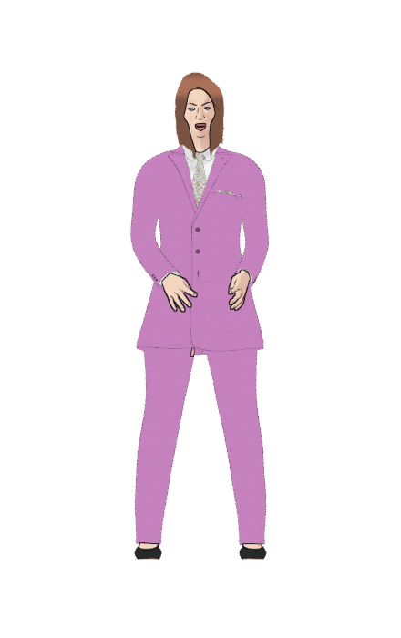
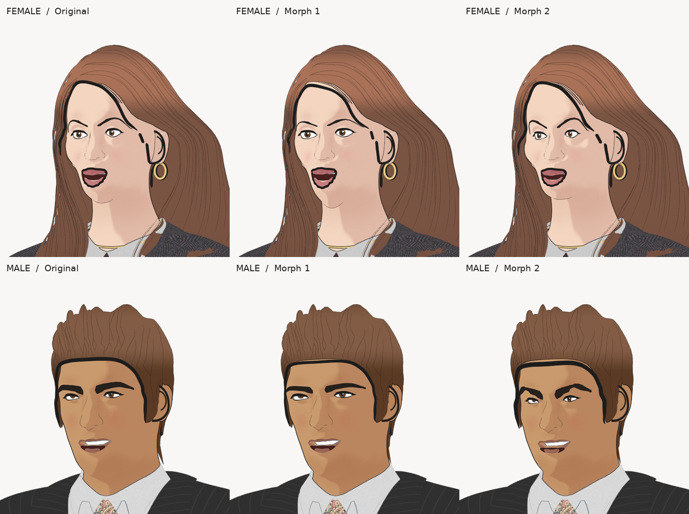
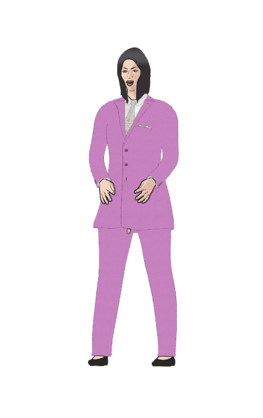

# NexStudio Illustrated V1 — Family Expansion Review

**Checkpoint:** 2026-10-10  
**Branch:** `work/illustrated-family-expansion-v1`  
**Production status:** **EXPERIMENTAL. Canonical original characters and approved performance assets remain unchanged.**  
**Proof policy:** All references below are real Blender output from the existing project; no generated concept images.

## 1. What is actually working

### Six complete real 3D formal outfit options

Six CC0 MakeHuman formalwear meshes were independently rebuilt on the **two existing original V1 characters** with the original source rigs and actions. These are six different outfits, **not six new people**. The female source has CC0 flats and the male uses his original existing formal shoes; suitable original UV textures and illustrated contours are preserved.

- [Six-outfit genuine Blender preview board](qa/six-authentic-illustrated-formal-cast-variants.png)
- [Independently re-opened Blender scene/hash manifest](formal-bank/BANK_MANIFEST.json)
- [All six suits across 10 original gesture frames — 60/60 structural pass](formal-bank-geometry-qa/QA_SUMMARY.json)
- [Female real original-action MP4, 4.25 seconds](motion-proofs/female-actual-original-gesture.mp4) · [Male real original-action MP4, 4.25 seconds](motion-proofs/male-actual-original-gesture.mp4). Both silent.
- **[Download the six editable and verified `.blend` outfits + PNGs (~126 MB)](https://github.com/Admiano/nexstudio/actions/runs/38004823946/artifacts/11650637868)**. Temporary GitHub Actions archive: retain a permanent copy separately before expiry.
- [Reproducible build instructions](formal-cast/README.md) and [builder CLI](../../scripts/illustrated-family/build_formal_cast.py).

A mechanical integrity pass **does not** certify cloth-body intersection, high-speed gesture deformation, chair contact, or professional presentation and speaking quality.

### Reversible real hairstyle switching

The original hairstyles remained inside the saved Blender scenes as selectable meshes. An opt-in script can activate original versus CC0-fitted alternatives with **exactly one visible hairstyle**, preserving the V1 163-bone rig and 34 body morph keys. Front and three-quarter renders prove both choices for female and male originals.

 

- [All four same-rig original/alternate proof renders](hair-switch-proof/), with machine-readable rig/mesh reports.
- [Tested reversible switch source](../../experiments/illustrated-family/switch_hair_trial.py).
- This is a **Blender functional prototype**, **not** a connected NexStudio editor UI.

### Native illustrated hair-color swatches

Copied instances of original `LINEART_HAIR_PAPER` materials have produced genuine **charcoal, caramel, near-black and silver** hair colors on selected licensed fitted meshes. The original materials were not modified.

- [Real four-color original-rig head and full-body Blender render proofs](hair-color-trials/)
- [Color trial source](../../experiments/illustrated-family/cc0_hair_color_trial.py).

## 2. Hair family: actual visual results and exclusions

The nominal Hair01 "CC0" pack is **not entirely CC0 on an individual donor basis**. Out of 25 donor hair definitions, 11 have an individual CC0 declaration, 10 say AGPL-3, and four have a different or unclear license. We do **not** treat all pack members as freely reusable based on the archive title.

- [Full 25-definition individual license and scale index](hair-inventory/Hair01_PER_ASSET_LICENSE_AND_SCALE.json).
- [11 geometry-only individually CC0-declared assets, including individual SHA hashes](hair-inventory/Hair01_CURATED_GEOMETRY_MANIFEST.json).
- **[Compact 11-mesh donor cache, around 0.8 MB ZIP](https://github.com/Admiano/nexstudio/actions/runs/38009389161/artifacts/11652557114)** (temporary GitHub artifact). Contains MHClO and OBJ geometry only, not original textures.
- [Detailed visual acceptance/rejection notes](HAIR_VARIANT_VISUAL_QA.md).

**Promising female options for additional art direction** (not approved to ship):
- [Inverted bob](hair-next-candidates/toigo_inverted_bob/female-hair-front-head-threeq.png): visible eyes and distinctive asymmetry, lower neckline needs polish.
- [Curled-under bob](hair-expanded-2/toigo_curled_under_bob/female-hair-front-head-threeq.png): rounded silhouette, exposed dark hairline band needs polish.
- [Inverted bob with bangs](hair-expanded-2/toigo_inverted_bob_with_bangs/female-hair-front-head-threeq.png): face readable, mass looks too smooth.
- [Original blunt bob with subtler curved 3D ink strokes](hair-curved-v2-previews/female-hair-front-head-threeq.png): surface registration works; artistry not final.

**Male hair candidates and rejections:**
- [Faydaen](hair-next-candidates/faydaen_hair_1/male-hair-front-head-threeq.png) is a niche expressive long-hair possibility, not a clean professional short haircut.
- [Cortu short messy](hair-trial-previews/male-hair-front-head-threeq.png), [strawberry cloud](hair-next-candidates/cortu_strawberry_cloud_hair/male-hair-front-head-threeq.png), [shaggy](hair-expanded-2/cortu_shaggy_green_hair/male-hair-front-head-threeq.png), and [straight bangs](hair-expanded-2/cortu_straight_bangs/male-hair-front-head-threeq.png) are **rejected** for face obstruction or unusable silhouettes. Do not integrate.

## 3. Four real facial-proportion trials: measured but not new identities

Two original-native face morphs for each gender really altered geometry (7.6–10.9 mm maximum sample displacement), with 163 rig bones and 34 shape keys retained. Front, three-quarter, and original performance-frame visual proofs were rendered.

- [All four independently measured facial geometry reports and full-body original-frame proofs](native-face-morph-trials/)
- [Matched original-face headshot baselines](native-face-baselines/) and [morphed head closeups](native-face-closeups/).

**Visual judgement:** These are facial proportion/brow/eye variants of the original two characters. They are **not four convincing new people**. A completed morph script or difference in geometry must not be confused with an approved distinct identity.

## 4. Production / V1 acceptance gates STILL OPEN

1. Visually approve only excellent alternate hairstyle silhouettes at portrait, full-body, rear/side, and original performance frames (current female bob candidates need polish; male short styles need a new design).
2. Produce **genuinely distinct new facial identities** with facial surface-registration and correct expressions/blinks/visemes; earlier experimental authored line-art faces are not approved.
3. Run full gesture-to-gesture and clothing/hand/chair contact **collision and quality** checks across relevant camera angles—not simply finite mesh checks.
4. Validate one-person host/presentation and two-person podcast switching with genuine original performance motion and a continuous narration pacing authority when appropriate.
5. Wire only approved outfit/hair/face/material combinations into the actual NexStudio **character customization UI**, including reversible selection and persisted character identity.
6. Preserve original V1 rigs, motion libraries, hand details, facial shape keys, materials, clothing, accessories, and scenes. **No silent replacement, deletion or propagation into production**.
7. Check upstream donor/embedded original-character license obligations before any redistribution or commercial deployment. An individually CC0 donor does **not** relicense the host character.

**Bottom line:** Six genuine formal outfits, tested rigged hair replacement, four hair color trials, native face morphs, licensed donor extraction and original-motion proofs have been built. **The standalone new-character family and production editor integration are not finished.**

[Canonical release-gates record](RELEASE_GATES.md).

## 5. Verified from-scratch combined character builder (new)

Rather than keeping separate baked characters for every clothing/hair/color choice, a single command-line builder now combines the **original V1 female or male rig**, one of the six formal outfits, an individually permitted hairstyle (or original), a copied hair color, and an optional inherited native face-morph setting. The original character data remains read-only.

The first [combined female Blender proof](composed-character-proofs/) was certified end to end: female statement suit + licensed inverted bob + charcoal `#343034` + native face morph 1. The final 21.3 MB saved scene reopened successfully with the original 163-bone rig/34 body shape keys and composed source objects. [Source and hashes](composed-character-proofs/character-composition-provenance.json); [download editable scene (temporary artifact)](https://github.com/Admiano/nexstudio/actions/runs/38010623944/artifacts/11653211274); [CLI source](../../scripts/illustrated-family/build_character_variant.py).

The builder is **not connected to the V1 UI or production renderer**. Native face adjustments do not yet provide adequately distinct new cast identities; one successful combined scene does not establish full outfit/face/gesture combination certification.
